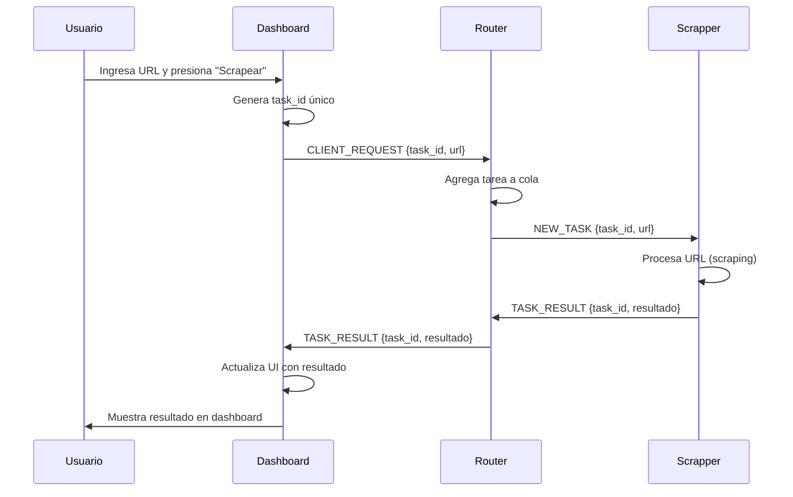

# Dashboard Streamlit - Interfaz Web para Scrapper Distribuido

## 🎯 Descripción General

El dashboard de Streamlit es una **interfaz web interactiva** que permite a los usuarios enviar tareas de scraping y visualizar resultados en tiempo real. Actúa como un **cliente especializado** que se conecta directamente al Router del sistema distribuido.

## 🏗️ Arquitectura del Sistema

```
┌─────────────────┐    WebSocket     ┌─────────────────┐
│   Dashboard     │◄────────────────►│   Router Node   │
│   Streamlit     │                  │                 │
│                 │  Mensajes JSON   │                 │
│  - UI Web       │                  │ - Distribuye    │
│  - Cliente TCP  │                  │ - Coordina      │
│  - Thread Safe  │                  │ - Responde      │
└─────────────────┘                  └─────────────────┘
         ▲                                     │
         │                                     ▼
         │                            ┌─────────────────┐
         │                            │ Scrapper Nodes  │
         │                            │                 │
         │                            │ - Procesa URLs  │
         │                            │ - Extrae datos  │
         │                            │ - Retorna info  │
         │                            └─────────────────┘
         │
   ┌─────────────┐
   │  Usuario    │
   │  (Browser)  │
   └─────────────┘
```

## 🔌 Conexión con el Router

### 1. Establecimiento de Conexión

```python
class StreamlitClient:
    def connect(self):
        # Crear conexión TCP persistente
        self.connection = NodeConnection(
            node_type='router',
            ip=self.router_ip,
            port=self.router_port,
            on_message_callback=self._handle_message,
            sender_node_type='client',
            sender_id=self.client_id
        )
        
        # Enviar identificación como cliente
        identification_msg = {
            'type': 'IDENTIFICATION',
            'sender_id': self.client_id,
            'node_type': 'client',
            'data': {
                'is_boss': False,
                'is_temporary': False,
                'port': 0
            }
        }
```

### 2. Características de la Conexión

- **Protocolo**: TCP persistente con mensajes JSON
- **Identificación**: Como nodo `client` no-boss
- **Callback**: Función para manejar respuestas asíncronas
- **Thread Safety**: Manejo seguro de concurrencia

## 📨 Flujo de Mensajes

### 1. Envío de Tarea de Scraping



### 2. Tipos de Mensajes

#### Cliente → Router (Peticiones)

```json
{
  "type": "CLIENT_REQUEST",
  "sender_id": "streamlit-abc123",
  "node_type": "client",
  "data": {
    "task_id": "uuid-único",
    "url": "https://ejemplo.com",
    "timestamp": "2026-01-09T07:04:29.123Z"
  }
}
```

#### Router → Cliente (Resultados)

```json
{
  "type": "TASK_RESULT",
  "sender_id": "router-principal", 
  "data": {
    "task_id": "uuid-único",
    "success": true,
    "result": {
      "url": "https://ejemplo.com",
      "html_length": 16423,
      "links_count": 21,
      "links": ["https://link1.com", "https://link2.com"],
      "status": "success"
    }
  }
}
```

## 🧵 Manejo de Threading y Estado

### Problema de Concurrencia

Streamlit ejecuta la interfaz en el **hilo principal**, pero los callbacks de red se ejecutan en **hilos separados**. El `session_state` NO es accesible desde otros hilos.

### Solución: Cola Thread-Safe

```python
# Cola global persistente entre reruns
if 'message_queue' not in st.session_state:
    st.session_state.message_queue = queue.Queue()

# Referencia global para callbacks
message_queue = st.session_state.message_queue

def _handle_task_result(self, message):
    """Ejecutado en hilo de red (NO puede usar session_state)"""
    result_data = {
        'task_id': data.get('task_id'),
        'success': data.get('success', False), 
        'result': data.get('result', {})
    }
    # Poner en cola thread-safe
    message_queue.put(result_data)

def process_pending_results():
    """Ejecutado en hilo principal (SÍ puede usar session_state)"""
    while not message_queue.empty():
        result_data = message_queue.get_nowait()
        # Procesar y actualizar session_state
        st.session_state.results.insert(0, result_entry)
```

### Flujo Thread-Safe

```
Hilo de Red              Cola Thread-Safe         Hilo Principal
     │                        │                        │
     ▼                        │                        │
[Recibe mensaje]              │                        │
     │                        │                        │
     ▼                        │                        │
[Procesa datos]               │                        │
     │                        │                        │
     ▼                        ▼                        │
[message_queue.put()]  ──────[Queue]                   │
                              │                        │
                              │                        ▼
                              │               [process_pending_results()]
                              │                        │
                              ▼                        ▼
                          [queue.get()]      [Actualiza session_state]
                                                       │
                                                       ▼
                                              [UI se actualiza]
```

## 🖥️ Componentes de la UI

### 1. Dashboard Principal

- **Métricas en tiempo real**: Total, exitosas, fallidas, pendientes
- **Auto-refresh**: Cada 2 segundos para updates dinámicos
- **Estado de conexión**: Verde/Rojo con información del router

### 2. Formulario de Scraping

```python
with st.form("scraping_form"):
    url = st.text_input("URL a scrapear")
    submit = st.form_submit_button("🕷️ Scrapear")
    
    if submit and url:
        task_id = client.send_scraping_task(url)
        # Agregar a pending_tasks para tracking
        st.session_state.pending_tasks[task_id] = {
            'url': url,
            'status': 'pending',
            'timestamp': datetime.now().isoformat()
        }
```

### 3. Visualización de Resultados

#### Métricas por Resultado
- **📄 Tamaño HTML**: Bytes del contenido descargado
- **🔗 Enlaces**: Cantidad de links encontrados
- **📊 Estado**: SUCCESS/ERROR

#### Enlaces Expandibles
```python
with st.expander(f"🔗 Ver enlaces encontrados ({len(links)} mostrados)"):
    for idx, link in enumerate(links, 1):
        st.markdown(f"{idx}. `{link}`")
```

## 🔄 Ciclo de Vida de una Tarea

### 1. Iniciación (UI)
```python
# Usuario ingresa URL → Botón submit
task_id = str(uuid.uuid4())
st.session_state.pending_tasks[task_id] = {...}
st.session_state.stats['pending'] += 1
```

### 2. Envío (Red)
```python
# Mensaje enviado al router
connection.send_message({
    'type': 'CLIENT_REQUEST',
    'data': {'task_id': task_id, 'url': url}
})
```

### 3. Procesamiento (Externo)
- Router recibe y delega al Scrapper
- Scrapper procesa URL y extrae datos
- Scrapper envía resultado al Router

### 4. Recepción (Callback Thread)
```python
def _handle_task_result(self, message):
    # Ejecutado en hilo de red
    message_queue.put(result_data)
```

### 5. Actualización (Main Thread)
```python
def process_pending_results():
    # Procesar cola en hilo principal
    result_data = message_queue.get_nowait()
    
    # Mover de pending a results
    del st.session_state.pending_tasks[task_id]
    st.session_state.results.insert(0, result_entry)
    
    # Actualizar estadísticas
    st.session_state.stats['pending'] -= 1
    st.session_state.stats['successful'] += 1
```

### 6. Visualización (UI)
- UI se refresca automáticamente
- Nuevo resultado aparece en la lista
- Métricas se actualizan instantáneamente

## 🛡️ Manejo de Errores

### Errores de Conexión
```python
try:
    if client.connect():
        st.session_state.connected = True
        st.success("✅ Conectado!")
    else:
        st.error("❌ Error al conectar")
except Exception as e:
    st.error(f"Error de conexión: {e}")
```

### Errores de Scraping
```python
if not result['success']:
    error_msg = result.get('error', 'Error desconocido')
    st.error(f"❌ **Error:** {error_msg}")
```

## 🎛️ Configuración

### Variables de Entorno
- `ROUTER_IP`: IP/hostname del router (default: 'router-node')
- `ROUTER_PORT`: Puerto del router (default: 7070)

### Parámetros de UI
- **Auto-refresh**: 2 segundos
- **Puerto Streamlit**: 8501
- **Modo headless**: Sin browser automático

## 🚀 Ventajas del Dashboard

1. **Tiempo Real**: Resultados aparecen inmediatamente
2. **Thread Safe**: Manejo correcto de concurrencia
3. **Persistente**: Conexión TCP mantenida
4. **Visual**: Métricas y gráficos intuitivos
5. **Escalable**: Soporta múltiples tareas simultáneas
6. **Responsive**: Auto-refresh dinámico

## 🔧 Uso con Docker

```bash
# Construir imagen
sudo docker build -t streamlit-app -f streamlit_app/Dockerfile .

# Ejecutar contenedor
sudo docker run -d \
  --name streamlit-app \
  --network scrapper-network \
  -p 8501:8501 \
  -e ROUTER_IP=router-node \
  streamlit-app

# Acceder en navegador
http://localhost:8501
```

Este dashboard proporciona una interfaz moderna y eficiente para interactuar con el sistema distribuido de scraping, manteniendo la arquitectura orientada a mensajes y garantizando la consistencia de datos en entornos concurrentes.